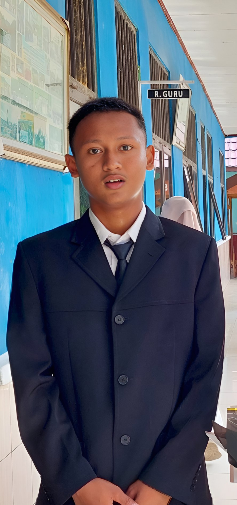

</head><meta name="google-site-verification" content="m2yxpAGDiBCKi4Xjd577S_BMBUM3eJ-nlApK9VdHQd0" />
    <meta charset="UTF-8">
    <meta name="viewport" content="width=device-width, initial-scale=1.0">

    <title>Data Diri | Andika Ramadani</title>

    
</head>

<body>

    <!-- NAVBAR -->
    <nav>
        

            

                ANDIKA.
            

            <ul class="menu">
                <li><a href="#home">Home</a></li>
                <li><a href="#tentang">Tentang</a></li>
                <li><a href="#biodata">Biodata</a></li>
                <li><a href="#keahlian">Keahlian</a></li>
                <li><a href="#pendidikan">Pendidikan</a></li>
                <li><a href="#kontak">Kontak</a></li>
            </ul>

        

    </nav>

    <!-- HOME -->
    <section class="hero" id="home">

        

            <!-- GANTI FOTO DI SINI -->
            

            <h1>Halo, Saya Andika Ramadani</h1>

            

                Siswa Kelas XI RPL | Web Developer Pemula
            

            <a href="#biodata" class="btn">
                Lihat Data Diri
            </a>

        

    </section>

    <!-- TENTANG SAYA -->
    <section id="tentang">

        

            <h2>Tentang Saya</h2>
            
Kenali saya lebih dekat

        

        

            

                Halo, nama saya <strong>Andika Ramadani</strong>.
                Saya adalah seorang siswa jurusan Rekayasa Perangkat Lunak
                (RPL).
            

            

                Saya sedang belajar mengenai dunia pemrograman,
                pembuatan website, database, dan berbagai teknologi
                komputer.
            

            

                Saya ingin terus mengembangkan kemampuan saya dalam
                bidang teknologi dan pemrograman serta membuat berbagai
                proyek yang bermanfaat.
            

        

    </section>

    <!-- BIODATA -->
    <section id="biodata">

        

            <h2>Biodata Diri</h2>
            
Informasi tentang diri saya

        

        

            

                <h3>Nama Lengkap</h3>
                
Andika Ramadani

            

            

                <h3>Kelas</h3>
                
XI RPL

            

            

                <h3>Jurusan</h3>
                
Rekayasa Perangkat Lunak

            

            

                <h3>Sekolah</h3>
                
SMK

            

            

                <h3>Tempat, Tanggal Lahir</h3>
                
19 September 2008

            

            

                <h3>Alamat</h3>
                
Merak Belantung

            

            

                <h3>Jenis Kelamin</h3>
                
Laki Laki

            

            

                <h3>Agama</h3>
                
Islam

            

        

    </section>

    <!-- KEAHLIAN -->
    <section id="keahlian">

        

            <h2>Keahlian</h2>
            
Kemampuan yang sedang saya pelajari

        

        

            

                
💻

                <h3>HTML</h3>
                
Membuat struktur halaman website.

            

            

                
🎨

                <h3>CSS</h3>
                
Membuat tampilan website menjadi lebih menarik.

            

            

                
⚙️

                <h3>JavaScript</h3>
                
Membuat website menjadi lebih interaktif.

            

            

                
🐘

                <h3>PHP</h3>
                
Mempelajari pemrograman web dari sisi server.

            

            

                
🗄️

                <h3>Database</h3>
                
Mempelajari penyimpanan dan pengolahan data.

            

            

                
🖥️

                <h3>VS Code</h3>
                
Menggunakan editor untuk membuat program.

            

        

    </section>

    <!-- PENDIDIKAN -->
    <section id="pendidikan">

        

            <h2>Pendidikan</h2>
            
Riwayat pendidikan

        

        

            <h3>SMKN 1 KALIANDA</h3>

            

                Jurusan: Rekayasa Perangkat Lunak (RPL)
            

            

                Kelas: XI RPL
            

        

        

            <h3>SMP</h3>

            

                SMPN 2 KALIANDA.
            

        

        

            <h3>SD</h3>

            

                SDN 1 MERAK BELANTUNG.
            

        

    </section>

    <!-- HOBI -->
    <section>

        

            <h2>Hobi</h2>
            
Beberapa kegiatan yang saya sukai

        

        

            
🎮 Gaming

            
💻 Coding

            
🎧 Musik

            
🎬 Menonton

            
📱 Teknologi

        

    </section>

    <!-- KONTAK -->
    <section id="kontak">

        

            <h2>Kontak</h2>
            
Hubungi saya melalui

        

        

            

                <strong>📧 Email</strong>
                <a href="mailto: andikaramadani889@gmail.com">
                    andikaramadani889@gmail.com
                </a>
            

            

                <strong>📱 WhatsApp</strong>
                <a href="https://wa.me/6280000000000">
                    08xxxxxxxxxx
                </a>
            

            

                <strong>📸 Instagram</strong>
                <a href="https://instagram.com/" target="_blank">
                    @ramaa_208
                </a>
            

            

                <strong>📍 Alamat</strong>
                Merak Belantung
            

        

    </section>

    <!-- FOOTER -->
    <footer>

        

            © 2026 Andika Ramadani.
            Semua Hak Dilindungi.
        

        

            XI RPL | Personal Website
        

    </footer>

</body>
</html>
